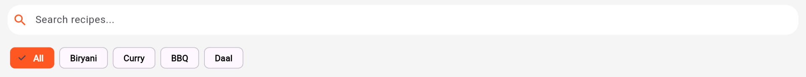
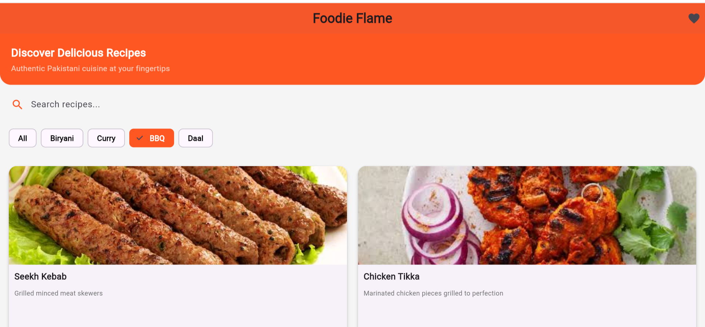
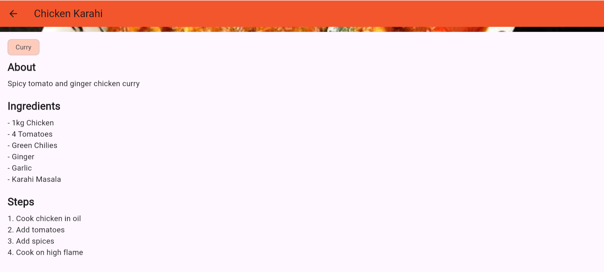

# 🍲 Foodie Flame

A beautiful **Flutter + Dart Recipe App** that helps users discover, search, and save their favorite recipes.

## 📱 About
**Foodie Flame** was built as part of my Flutter learning journey.  
The goal of this app is to make recipe discovery simple and fun. Users can browse recipes by category, search for dishes, and save favorites to cook later.

This project focuses on clean UI, smooth navigation, and practical state management.

## ✨ Key Features
- **🔍 Smart Search**: Find recipes by name or ingredients instantly
- **📂 Categories**: Browse recipes by `Breakfast`, `Lunch`, `Dinner`, `Desserts`, and more
- **❤️ Favorites**: Save your favorite recipes to a dedicated favorites screen
- **📖 Recipe Details**: View full ingredients list and step-by-step cooking instructions
- **📱 Responsive UI**: Clean and modern design that works on Android, iOS, and Web
- **⚡ Fast Performance**: Optimized widgets and state management for smooth experience

## 💻 Tech Stack
| Category | Technology |
| --- | --- |
| **Framework** | Flutter 3.x |
| **Language** | Dart |
| **State Management** | Provider / setState |
| **IDE** | VS Code / Android Studio |

## 🏗️ Project Structure
```
lib/
├── models/        # Recipe data models
├── screens/       # Home, Categories, Favorites, Details
├── widgets/       # Reusable UI components
├── providers/     # State management with Provider
└── main.dart      # App entry point
```

## 🚀 Getting Started
To run this project locally:
1. Download the code from the `Code` button above
2. Run `flutter pub get` in terminal
3. Run `flutter run`

## 📸 Screenshots
| Home | Categories | Recipe Details |
| --- | --- | --- |
|  |  |  |

## 🔮 Future Improvements
- [ ] Add recipe API integration instead of local data
- [ ] User authentication with Firebase
- [ ] Dark mode support
- [ ] Share recipe feature
- [ ] Add cooking timer

## 👤 Author
**Urva Sohail**  
Aspiring Flutter Developer 

GitHub: [@urva734](https://github.com/urva734)


